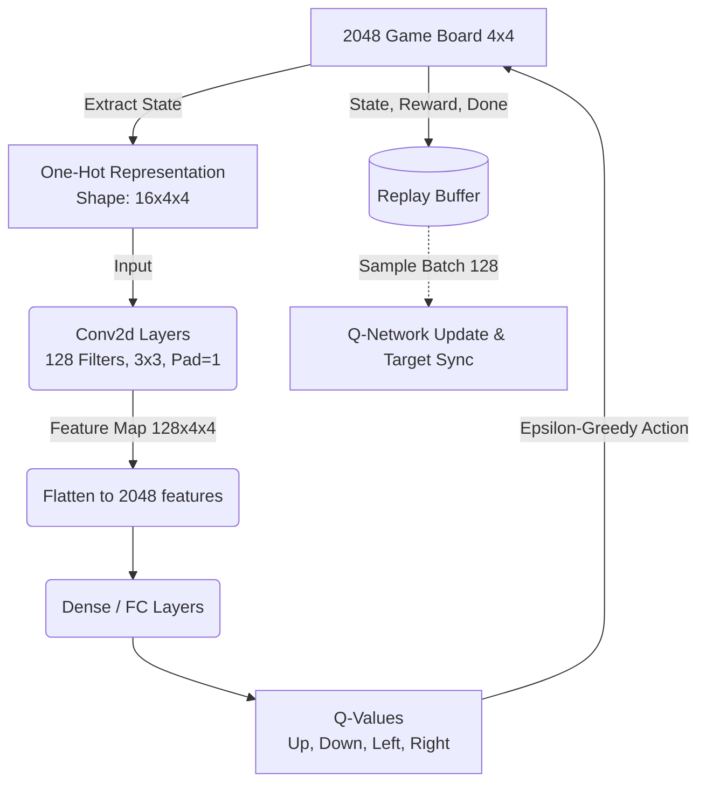

# CNN DQN - 2048 Optimization

This document summarizes the recent architectural and configuration improvements applied to the Convolutional Neural Network Deep Q-Network (CNN DQN) agent for the game 2048. 

The modifications were executed to tackle premature convergence (getting stuck around the 128/256 tile mark) and gradient noise, unlocking the model's potential to discover long-term strategies.

## Overall Architecture Flow

## Summary of Changes

### 1. Expanded Receptive Field (`models/cnn_q_network.py`)
- **Problem**: The original model used two layers of `2x2` convolutions with `padding=0`, shrinking the `4x4` input feature map down to `2x2`. As a result, the receptive field did not span the entire board, preventing the model from capturing spatial relationships between opposite corners.
- **Solution**: 
  - Upgraded kernel sizes to `3x3` and introduced `padding=1`. 
  - This preserves the full `4x4` spatial dimension across multiple convolutional layers, ensuring that every chunk of the board can cross-communicate before being flattened. 
  - Adjusted the subsequent fully-connected (Dense) layer to accept linearly flattened size `128 * 4 * 4 = 2048`.

### 2. Reduced Noise in Reward Shaping (`envs/cnn_env.py`)
- **Problem**: A dense shaping reward of `empty_spots * 1.0` heavily distracted the agent, prioritizing keeping tiles empty over creating larger values (which is the actual path to higher scores). Additionally, `np.log2(board)` sometimes triggered `RuntimeWarning: divide by zero` due to evaluating `0` values prematurely.
- **Solution**: 
  - Diminished the scalar multiplier for empty spots down to `0.1`, forcing the agent to rely more on the foundational game score reward and the monotonic layout penalty.
  - Implemented a `np.maximum(board, 1)` guard inside the log calculation to sanitize values and suppress runtime warnings without affecting logic.

### 3. Extended Phase of Exploration (`config.json`)
- **Problem**: Over the course of testing, `eps_decay_steps` was set to `200,000`. In a 15,000 episode training run, this meant the agent stopped exploring and strictly adhered to a highly exploitative policy in less than ~15% of the timeframe, causing immediate local optima trapping.
- **Solution**: 
  - Modified `eps_decay_steps` up to `2,000,000`. The extensive epsilon decay trajectory allows the model to consistently encounter and experience deeper, late-game board states before exploiting the learned policy.
  
## Usage Notice
* If analyzing loss curves: Note that DQN loss is naturally extremely noisy due to target-network synchronization and Replay Buffer randomized sampling. Focus evaluation metrics primarily on the *Mean Return*, *Mean Max Tile*, and *Illegal Avoidance* graphs.
* When doing rapid testing (e.g. debugging via `num_episodes=200`), remember to temporarily scale down `eps_decay_steps` accordingly (e.g., to `20000`) so that you can effectively observe the shift from exploration to exploitation!
